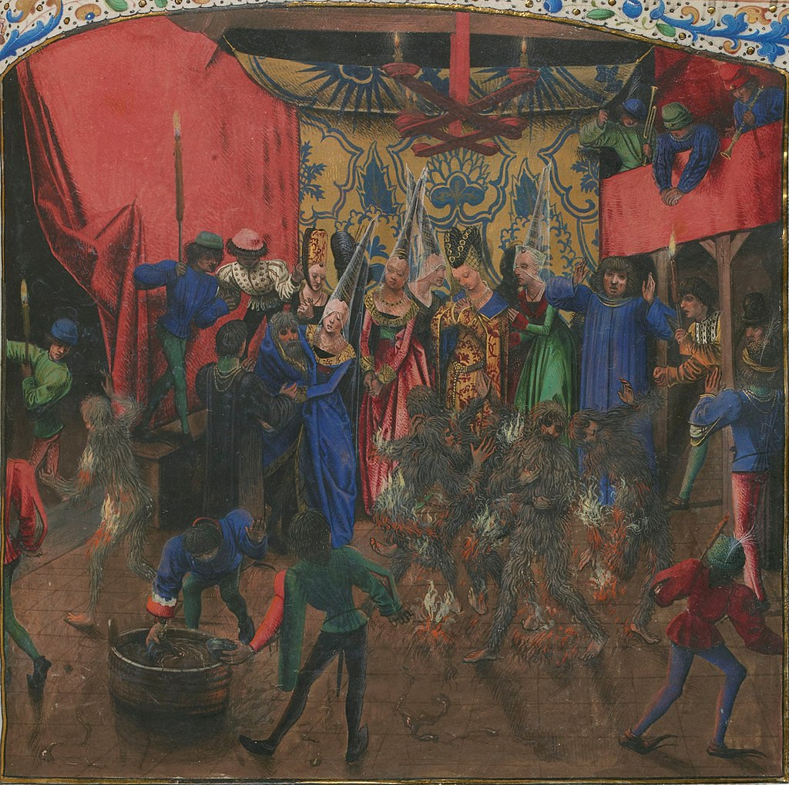

# ÉDITION CRITIQUE DES *CHRONIQUES* DE JEAN FROISSART EN XML-TEI

Transformation XSL vers LaTeX d'une édition critique encodée en XML-TEI du chapitre 
**SHF 306** : *la négogiation du mariage du Duc de Berry*.

Le fichier XSL produit a été visualisé et fonctionne sur TeXstudio avec un compilateur XeLaTeX.
Des fois, des erreurs de compilation peuvent avoir lieu (toutes les notes de bas de page 
renvoient à la ligne `0` ou se trouvent à la fin du document). Dans ce cas, relancer la 
compilation.

---

### Structure du dépôt
- **`dossier racine`**:
	- `froissart.jpg` : une petite image pour décorer le présent README
	- `LICENSE` : la licence GNU GPL 3 sous laquelle est ce projet
	- `README.md` : le présent document
- **`attributs_valeurs`** : trois tableaux listant les valeurs possibles pour des attributs 
fréquemment utilisés : `persName`, `placeName` et `corresp`.
- **`odd_documentation`** : l'ODD au format `.xml` et sa transformation aux formats 
`.rng`, `.dtd` et `.html`.
- **`textes`** : le contenu textuel des trois témoins, utilisés comme source pour l'édition
critique.
- **`transformation`** : le fichier XML TEI utilisé en entrée (`froissart.xml`), la feuille de 
style (`froissart.xsl`) et le fichier LaTeX produit en sortie (`froissart.xsl`).

---

### Modifications faites par rapport à l'encodage originel

L'encodage a été réalisé pour l'évaluation du cours de TEI donné par S. Albouy, sans prendre en
compte une future transformation XSL. Des modifications ont donc du être apportées pour 
permettre la transformation :
- les **`app` contenus dans des `rdg`** ont été transformés en `rdgGrp` : ils ne pourraient pas
être retranscrits en latex.
- une ** erreurs mineure** d'encodage a été corrigée.

---

### Choix d'encodage retenus pour la transformation

L'édition critique en XML-TEI qui est ici transformée est très (trop ?) détaillée: j'ai choisi 
de documenter toutes les variations entre les trois témoins : changements au niveau du texte,
de la structure du texte (paragraphes et sauts de page) et changements dans la décoration des
manuscrits. Tous ces éléments peuvent difficilement être traduits dans une édition critique
"traditionnelle" (papier) ; les principes suivants ont donc été suivis :
- L'apparat critique est construit avec la leçon principale (témoin de Berlin) en corps de 
texte ; en notes de bas de page, les variations et autres détails sont signalés avec 
**un système de notes à quatres étages** : 
	- `\variant` correspond à `\Afootnote` et permet d'encoder les variations "simples" 
entre les leçons
	- `\group` correspond à `\Bfootnote` et permet d'encoder les groupes de temoins (
`<rdgGrp>` en TEI)
	- `\subvariant` correspond à `\Cfootnote` et permet d'encoder les sous-variations dans
des apparats internes (en termes TEI : les `rdg` qui sont dans des `<app>` dans des `<app>`)
	- `\explan` correspond à `\Dfootnote` et permet d'encoder les éléments "non textuels"
du témoin principal (décorations et sauts de page encodés dans des `<witDetail>`, changements
de paragraphes).
- Au sein d'un apparat critique (`<app>`) les **groupes de témoins** qui ne contiennent pas la
leçon principale (en langage TEI les `<rdgGrp>` qui contiennent deux `<rdg>`, mais pas de
 `<lem>`) se trouvent dans une note de deuxième niveau (`\group`, en latex). Si un `<rdgGrp>`
contient une partie du témoin principal, il n'est pas retranscrit en latex.
- Les **apparats internes** (un `<app>` dans un `<app>`) sont retranscrits en bas de base grâce à
un `\subvariant` (note de 3e degré).
- Pour la leçon principale (le manuscrit de Berlin), la **structure du texte** est traduite:
	- les **sauts de paragraphe** sont reportés en note de bas de page dans un `\explan` 
(correspondant) à une note de 4e niveau et signifiés dans le corps du texte par un saut 
de paragraphe (`\pend \pstart`, avec `reledmac`).
	- les **sauts de page** sont également reportés en bas de page dans un `\explan` ; le
numéro de page est également mentionné. Il n'y a pas de saut de page dans le corps du texte 
pour éviter d'avoir un résultat trop morcelé.
	- les détails sur la décoration du texte sont mentionnés en 
notes de bas de page, dans un `\explan`
- Pour les autres leçons (témoins d'Anvers et de Berne), ces détails ne sont pas mentionnés.

